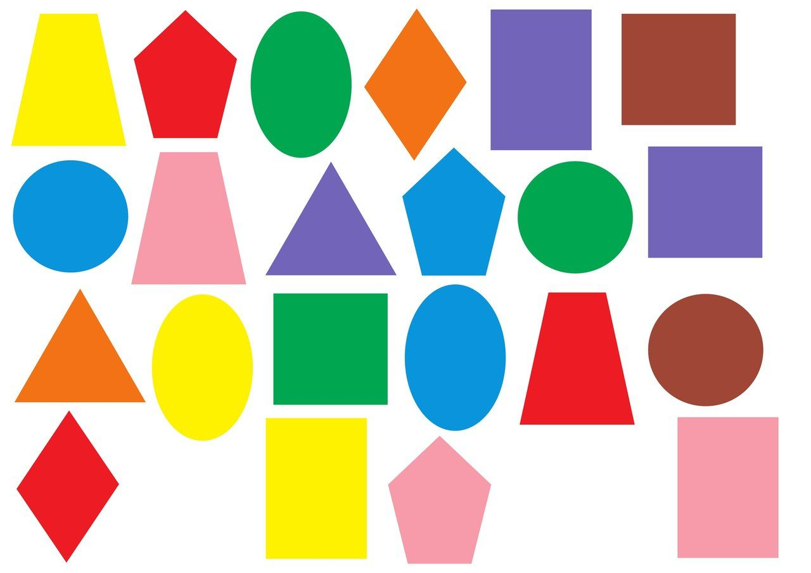
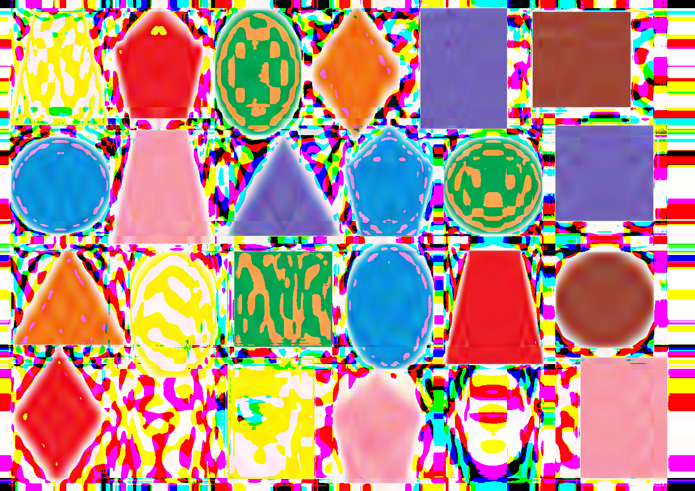
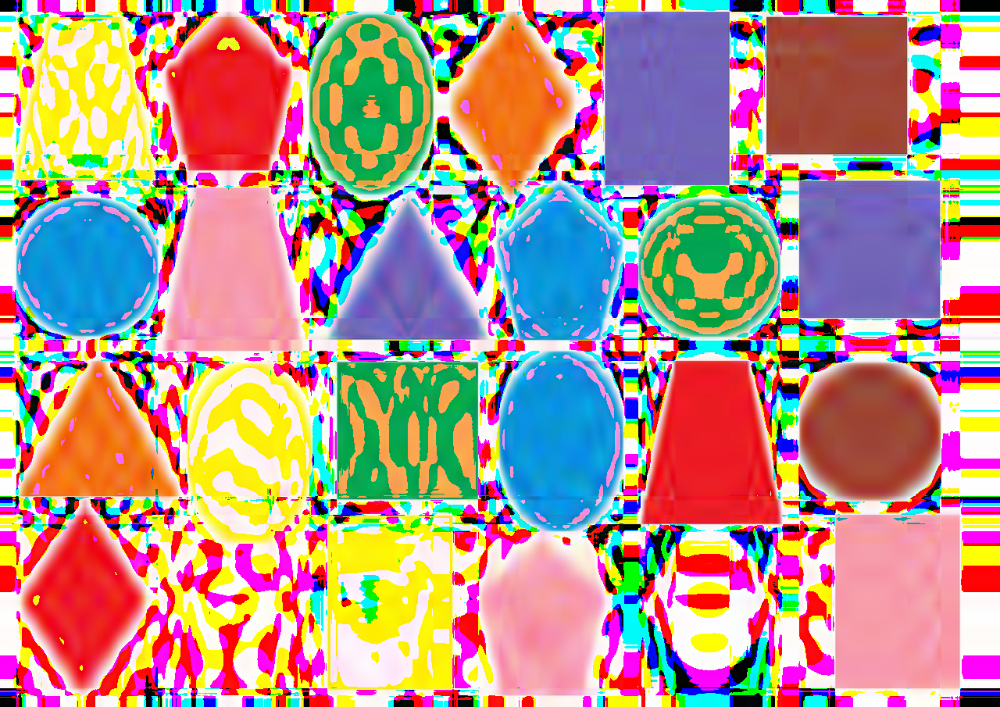
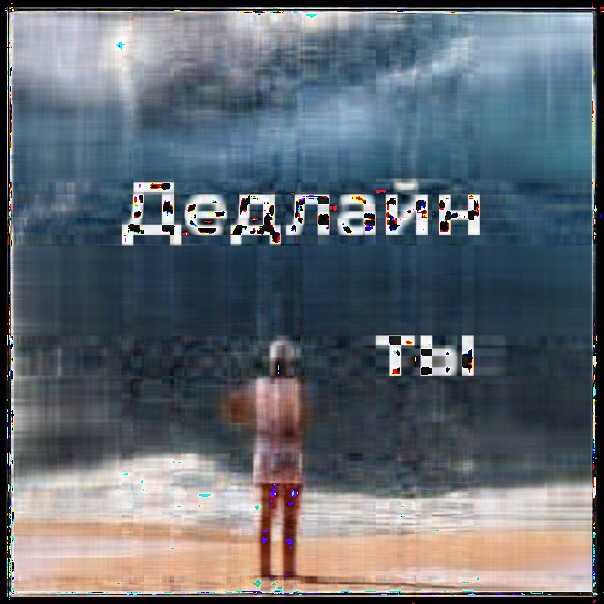

# Исполльзование сингулярного разложения для сжатия BMP изображений

### Описание эксперимента

Для сжатия изображений реализованы 3 различных алгоритма сингулярного разложения:
- стандартный, реализованный в numpy
- SVD с помощью power iterations (степенной метод)
- Block power iterations (блочная версия степенного метода)

Хотим на практике сравнить 3 различных подхода, сравнить эффективность данных методов на практике, оценить какой из методов удобнее в использовании

### Как храним изображение в сжатом формате

Первые 6 байт хранят числа N, M, K (по 2 байта на число)

Для каждого из 3 цветовых каналов храним по 3 матрицы размеров: `N×K, K×K, K×M`, получаемые из SVD разложения
Матрица размера `K×K` - диагональная и из нее храним только диагональные элементы.

Все значения вещественные и занимают по 8 байт на значение

Итого итоговый размер файла (в байтах) составляет: `6 + 3 * 8 * K * (N + M + 1))`

### Примеры сжатия

Сжатие проводилось на изображении геометрических фигур (1280 × 905 пикселей), изображении копатыча (1280 × 720 пикселей) и жизненной картинке (604 × 604 пикселей)

Первое изображение сжали в 3 раза, второе в 5, третье в 2 рааз. Сравним результаты, полученные разными алгоритмами:

| Исходное изображение | NumPy | Simple | Advanced |
|---|---|---|---|
|  |  |  |  |
|  |  |  |  |
 |  |  |  |

### Результаты

Большой разницы в качестве полученных изображений при фиксированном размере сжатия пронаблюдать не получилось: все три алгоритма дают похожие по качеству результаты

Заметным различаемым показателем стало время работы. Стандартное разложение, реализованное в NumPy делает это быстрее самописных (даже c учетом небольшого числа итераций при запуске). Поэтому готовую реализиацию можно считать предпочтительным методом

