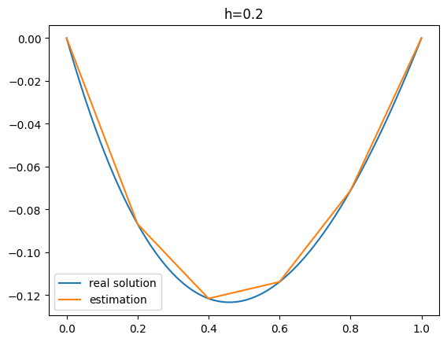
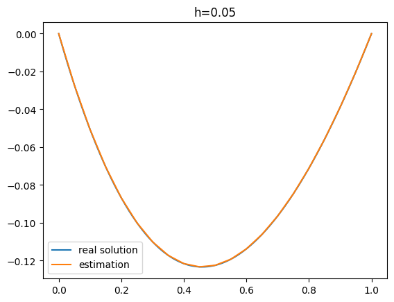
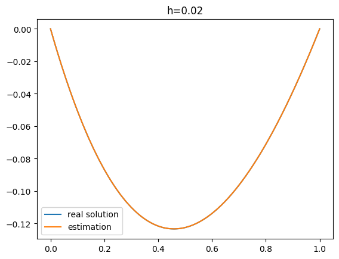
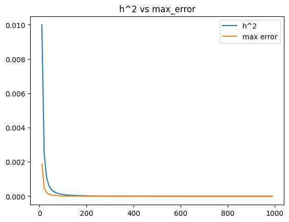
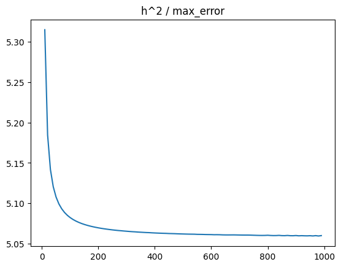

# Метод конечных элементов

### Описание эксперимента

Хотим реализовать метод конечных элементов для построения приближенного решения краевой задачи и сравнить теоритическую ошибку метода с полученными результатами

В качестве задачи для поиска приближенного решения была взята следующая:

$(e^x*y')' = e^x$

Граничные условия: $y(0) = y(1) = 0$

Явное решение этого уравнения имеет следующий вид: $y(x) = \frac{-e*x + x + e^{1-x} + e}{1 - e}$

Ожидаем увидеть максимальную ошибку порядка меньше либо равного $h^2$, где $h$ - расстояние между соседними точками, по которым строится приближение

### Про запуски

Все запуски производились один раз, т.к. получаемый результат детерминирован. Запуск на разном оборудовании не проводился, поскольку мы не оцениваем скорость работы алгоритма.

Для оценки максимальной ошибки использовалось максимальное отклонение (по модулю) правильного решения от приближенного на равномерной сетке на $[0, 1]$ размера $N=100000$

### Результаты

Посмотрим на результат приближений при различных значениях параметра $h$

Как мы видим, при $h = 0.02$ результат приближения уже практически не отличим от правильного решения

Оценим теперь скорость сходимости к точному решения и проверим гипотезу, что порядок не меньше 2

Сравним $h^2$ с максимальной ошибкой при разных размерах равномерной сетки $N = range(10, 1000, 10)$ - все значения от 10 до 1000 включительно с шагом 10, $h = 1 / N$

При больших значениях сетки визуально не получается сравнить  $h^2$ с максимальной ошибкой, поэтому давайте построим график отношений $h^2$ к максимальной ошибке

Теперь уже хорошо видно, что макисмальная ошибка примерно в 5 раз меньше $h^2$ при поиске приближенного решения на рассматриваемом нами примере.

Это подтверждает гипотезу о порядке сходимости